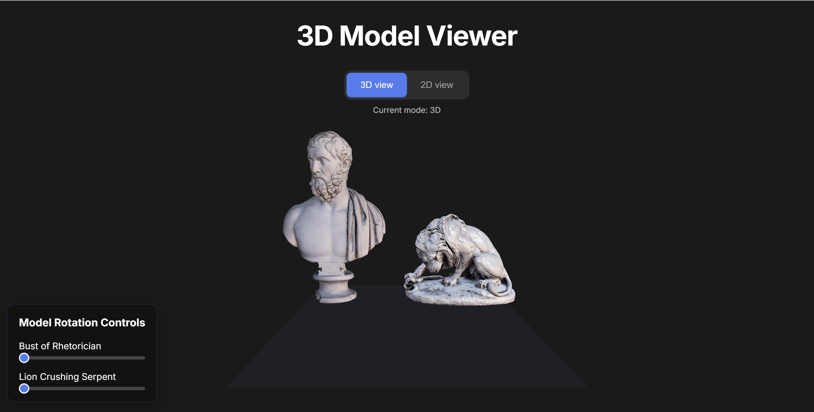
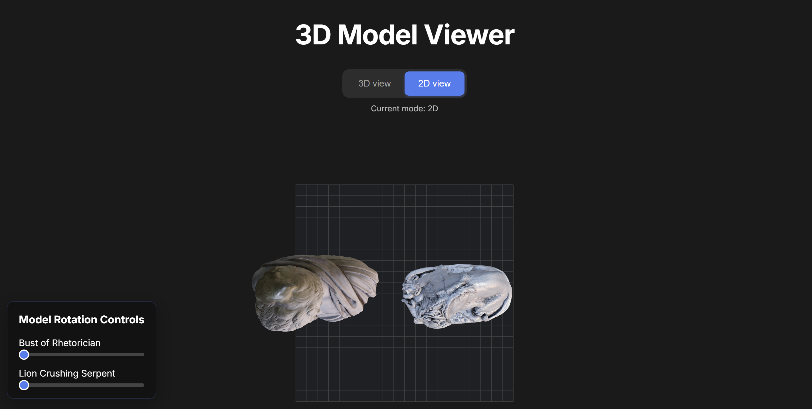

# 3D Model Viewer

An interactive 3D web application for managing and manipulating GLB 3D models with real-time Firebase synchronization.

## Interface




## Features Demo


## Overview

This application provides an intuitive interface for viewing and manipulating two 3D models in both 3D and 2D perspectives. All model positions and rotations are automatically synchronized with Firebase Firestore for persistence across sessions.

## Features

### Interactive Controls
- **Drag & Drop**: Click and drag models to reposition them within the scene
- **Collision Detection**: Visual feedback prevents models from overlapping
- **Rotation Controls**: Intuitive sliders for precise model rotation
- **Dual View Modes**: Toggle between 3D perspective and 2D top-down views

### Real-time Synchronization
- **Firebase Integration**: All changes automatically saved to Firestore
- **Persistent State**: Model positions and rotations preserved between sessions
- **No Authentication Required**: Public access for all users

## Tech Stack

- **Frontend Framework**: Next.js 14.2.8 with TypeScript
- **3D Rendering**: Three.js 0.168.0 + React-Three-Fiber 8.15.11
- **Database**: Firebase Firestore 10.7.1
- **Styling**: CSS Modules with global styles
- **Development**: ESLint, TypeScript strict mode

## Project Structure

```
3d-web-app/
├── app/
│   ├── globals.css          # Global styles and animations
│   ├── layout.tsx           # Root layout component
│   └── page.tsx             # Main application page
├── components/
│   └── DualModelViewer.tsx  # Core 3D scene component
├── hooks/
│   ├── useCollisionDetection.ts  # Collision detection logic
│   ├── useDragControls.ts       # Drag and drop functionality
│   ├── useModelSync.ts          # Firebase synchronization
│   └── useVisualFeedback.ts     # UI feedback management
├── lib/
│   └── firebase.ts          # Firebase configuration
├── public/
│   └── models/
│       ├── bust_of_a_rhetorician.glb
│       └── lion_crushing_a_serpent.glb
├── .env.example             # Environment variables template
└── package.json
```

## Getting Started

### Prerequisites

- Node.js 18+ and npm
- Firebase project with Firestore enabled

### Installation

1. **Clone the repository**
   ```bash
   git clone https://github.com/dzelilah/3d-model-viewer.git
   cd 3d-model-viewer
   ```

2. **Install dependencies**
   ```bash
   npm install
   ```

3. **Configure Firebase**
   ```bash
   # Copy environment template
   cp .env.example .env.local
   
   # Edit .env.local with your Firebase credentials
   NEXT_PUBLIC_FIREBASE_API_KEY=your-api-key
   NEXT_PUBLIC_FIREBASE_AUTH_DOMAIN=your-domain.firebaseapp.com
   NEXT_PUBLIC_FIREBASE_PROJECT_ID=your-project-id
   NEXT_PUBLIC_FIREBASE_STORAGE_BUCKET=your-bucket.firebasestorage.app
   NEXT_PUBLIC_FIREBASE_MESSAGING_SENDER_ID=your-sender-id
   NEXT_PUBLIC_FIREBASE_APP_ID=your-app-id
   ```

4. **Set up Firebase Firestore**
   - Create a new Firebase project at https://console.firebase.google.com
   - Enable Firestore Database
   - Set security rules to allow public read/write access:
   ```javascript
   rules_version = '2';
   service cloud.firestore {
     match /databases/{database}/documents {
       match /{document=**} {
         allow read, write: if true;
       }
     }
   }
   ```

5. **Start development server**
   ```bash
   npm run dev
   ```

6. **Open application**
   Navigate to `http://localhost:3000` in your browser

## Usage Guide

### Basic Operations

1. **View Toggle**
   - Use the "3D view" / "2D view" buttons to switch perspectives
   - 3D view: Full orbital camera controls
   - 2D view: Top-down orthographic projection

2. **Model Manipulation**
   - **Move**: Click and drag any model to reposition
   - **Rotate**: Use the sliders below the scene
   - **Collision**: Red circles indicate invalid positions

3. **Visual Indicators**
   - **Green circles**: Safe to drop model
   - **Red circles**: Collision detected, drop prevented
   - **Blue outline**: Model hover state

