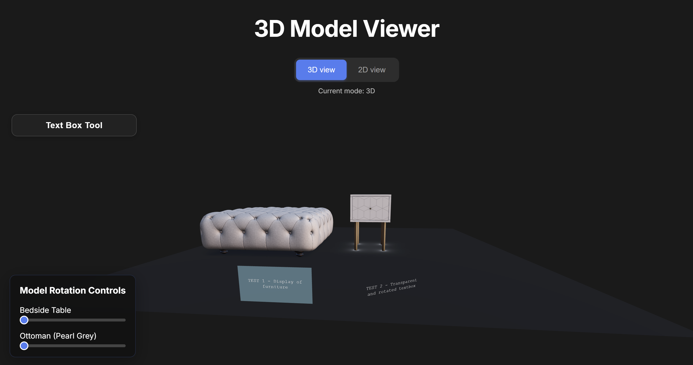
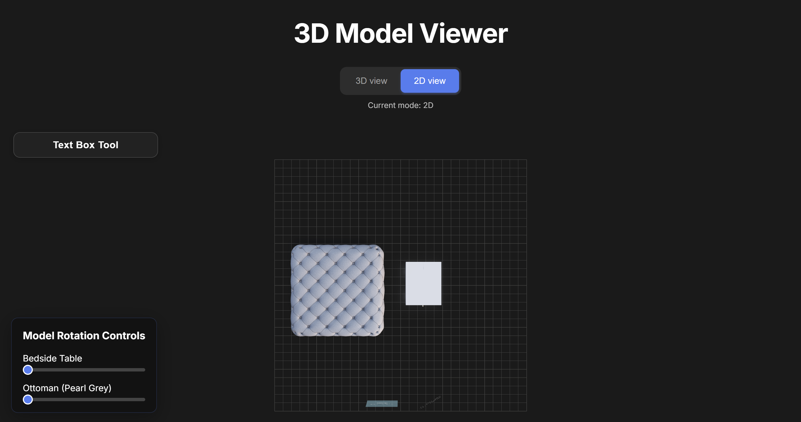

# 3D Model Viewer

## Live Demo

[View the deployed app on Vercel](https://3d-model-viewer-demo.vercel.app/)

An interactive 3D web application for managing and manipulating GLB 3D models with real-time Firebase synchronization.

## Interface




## Features Demo


## Overview

This application provides an intuitive interface for viewing and manipulating two 3D models in both 3D and 2D perspectives. All model positions and rotations are automatically synchronized with Firebase Firestore for persistence across sessions.

## Features

### Interactive Controls

- **Drag & Drop**: Click and drag models to reposition them within the scene
- **Collision Detection**: Visual feedback prevents models from overlapping
- **Rotation Controls**: Intuitive sliders for precise model rotation
- **Dual View Modes**: Toggle between 3D perspective and 2D top-down views
- **Editable 3D Text Box**: Select the 3D Text Box tool, then click anywhere on the canvas to place a new box. Each box supports:
  - Editable text
  - Editable background (choose color or set transparent)
  - Editable letter color
  - Fixed position and rotation: the box stays in place and maintains its orientation as the camera moves
  - Multiple boxes can be created and placed independently
  - All boxes are saved in the database (Firebase Firestore)
  - Editing overlay is large, easy to use, and does not rotate with the box
  - Overlay controls include color/background pickers, opacity slider, and auto-growing textarea
  - "Delete" and "Done" buttons are positioned side by side for usability

### Real-time Synchronization

- **Firebase Integration**: All changes automatically saved to Firestore
- **Persistent State**: Model positions and rotations preserved between sessions
- **No Authentication Required**: Public access for all users

## Tech Stack

- **Frontend Framework**: Next.js 14.2.8 with TypeScript
- **3D Rendering**: Three.js 0.168.0 + React-Three-Fiber 8.15.11
- **Database**: Firebase Firestore 10.7.1
- **Styling**: CSS Modules with global styles
- **Development**: ESLint, TypeScript strict mode

## Project Structure

```
3d-web-app/
├── app/
│   ├── globals.css                # Global styles and animations
│   ├── layout.tsx                 # Root layout component
│   └── page.tsx                   # Main application page
├── components/
│   ├── DualModelViewer.tsx        # Core 3D scene component
│   └── TextBox.tsx                # Editable 3D Text Box component
├── hooks/
│   ├── useCollisionDetection.ts   # Collision detection logic
│   ├── useDragControls.ts         # Drag and drop functionality
│   ├── useModelSync.ts            # Firebase synchronization
│   ├── useTextBoxes.ts            # 3D Text Box management
│   └── useVisualFeedback.ts       # UI feedback management
├── lib/
│   └── firebase.ts                # Firebase configuration
├── public/
│   ├── demo/
│   │   ├── 2Dview.png             # 2D view screenshot
│   │   ├── 3Dview.png             # 3D view screenshot
│   │   └── demo3DModelViewer.gif  # Features demo GIF
│   └── models/
│       ├── branagh_large_ottoman_pearl_grey.glb
│       └── hedra_bedside_table_grey_and_brass.glb
├── .env.example                   # Environment variables template
├── .env.local                     # Local environment variables
├── next-env.d.ts                  # Next.js TypeScript definitions
├── next.config.js                 # Next.js configuration
├── package.json                   # Project metadata and dependencies
├── package-lock.json              # Dependency lock file
├── tsconfig.json                  # TypeScript configuration
└── README.md                      # Project documentation
```

## Getting Started

### Prerequisites

- Node.js 18+ and npm
- Firebase project with Firestore enabled

### Installation

1. **Clone the repository**

   ```bash
   git clone https://github.com/dzelilah/3d-model-viewer.git
   cd 3d-model-viewer
   ```

2. **Install dependencies**

   ```bash
   npm install
   ```

3. **Configure Firebase**

   ```bash
   # Copy environment template
   cp .env.example .env.local

   # Edit .env.local with your Firebase credentials
   NEXT_PUBLIC_FIREBASE_API_KEY=your-api-key
   NEXT_PUBLIC_FIREBASE_AUTH_DOMAIN=your-domain.firebaseapp.com
   NEXT_PUBLIC_FIREBASE_PROJECT_ID=your-project-id
   NEXT_PUBLIC_FIREBASE_STORAGE_BUCKET=your-bucket.firebasestorage.app
   NEXT_PUBLIC_FIREBASE_MESSAGING_SENDER_ID=your-sender-id
   NEXT_PUBLIC_FIREBASE_APP_ID=your-app-id
   ```

4. **Set up Firebase Firestore**

   - Create a new Firebase project at https://console.firebase.google.com
   - Enable Firestore Database
   - Set security rules to allow public read/write access:

   ```javascript
   rules_version = '2';
   service cloud.firestore {
     match /databases/{database}/documents {
       match /{document=**} {
         allow read, write: if true;
       }
     }
   }
   ```

5. **Start development server**

   ```bash
   npm run dev
   ```

6. **Open application**
   Navigate to `http://localhost:3000` in your browser

## Usage Guide

### Basic Operations

1. **View Toggle**

   - Use the "3D view" / "2D view" buttons to switch perspectives
   - 3D view: Full orbital camera controls
   - 2D view: Top-down orthographic projection

2. **Model Manipulation**

   - **Move**: Click and drag any model to reposition
   - **Rotate**: Use the sliders below the scene
   - **Collision**: Red circles indicate invalid positions
   - **Model Picking**: Models are only selected when clicked directly, not by clicking around them

3. **Visual Indicators**

   - **Green circles**: Safe to drop model
   - **Red circles**: Collision detected, drop prevented
   - **Blue outline**: Model hover state

4. **Editable 3D Textboxes**
   - Add textboxes by clicking on the grid; placement is accurate to the click location
   - Textboxes feature editable text, custom color, background, transparency, and upright readable text
   - Editing overlay is fixed (does not rotate with the mesh), large, and easy to use
   - Overlay controls include color/background pickers, opacity slider, and auto-growing textarea
   - "Delete" and "Done" buttons are positioned side by side for usability
   - Mesh rotation is independent of the overlay; text remains upright and readable
   - All changes are persisted in Firebase Firestore
